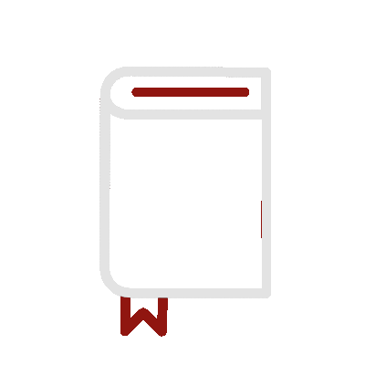

# Hello There!  

I am <strong>Charbel</strong> aka <strong>Murf</strong>, a CS student, who loves programming in a creative manner.

-  Currently working as software engineer.
-  I’m currently learning nextjs.
-  Ask me about anything tech related.
-  Mastering python and js.
- More info [here](https://murf-y.github.io/)

# Tools and Languages 

### Socials

    

# Stats 

<b>Top Repositories</b>

       
